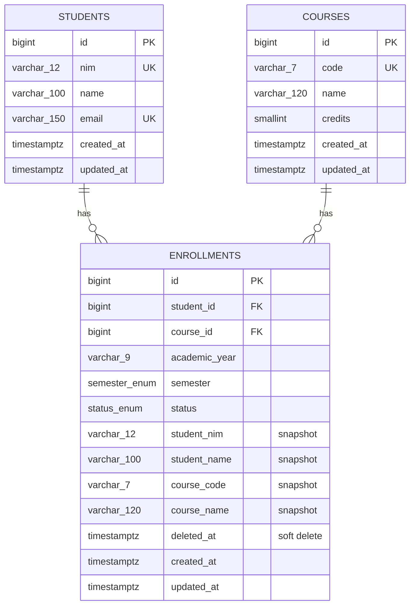

# KRS Akademik — Single Page CRUD (Skala 5 Juta Baris)

Sistem manajemen KRS (Kartu Rencana Studi) yang dirancang untuk menangani dataset akademik berskala besar (≥5.000.000 baris `enrollments`) dengan CRUD atomic 3-tabel, server-side pagination/sorting/filtering/searching, dan export CSV streaming.

Dibuat untuk memenuhi **Tes Teknis Web Developer (Full Stack) — Single Page CRUD Akademik**.

> **Status dokumen:** README ini ditulis berdasarkan source code yang ada di repo per commit terakhir. Bagian yang butuh input dari kandidat (link deploy, screenshot, angka performa hasil eksekusi nyata) ditandai `[ISI DI SINI]` — **wajib diisi sebelum submit**, jangan biarkan placeholder.

---

## Daftar Isi

1. [Ringkasan Aplikasi](#1-ringkasan-aplikasi)
2. [Demo & Repository](#2-demo--repository)
3. [Tech Stack & Alasan Pemilihan](#3-tech-stack--alasan-pemilihan)
4. [Arsitektur](#4-arsitektur)
5. [Skema Database (ERD) & Index](#5-skema-database-erd--index)
6. [Setup Lokal](#6-setup-lokal)
7. [Seeding 5 Juta Data & Pembuktian](#7-seeding-5-juta-data--pembuktian)
8. [Strategi Performa](#8-strategi-performa)
9. [Transaksi Atomic 3 Tabel & Cara Uji Rollback](#9-transaksi-atomic-3-tabel--cara-uji-rollback)
10. [Soft Delete: Pilihan & Dampak](#10-soft-delete-pilihan--dampak)
11. [Interpretasi Advanced Order & AND/OR](#11-interpretasi-advanced-order--andor)
12. [Kontrak API & Contoh cURL](#12-kontrak-api--contoh-curl)
13. [Panduan Deploy](#13-panduan-deploy)
14. [Pemetaan Skenario Pengujian (TS-01 s/d TS-13)](#14-pemetaan-skenario-pengujian-ts-01-sd-ts-13)
15. [Asumsi & Limitasi yang Diketahui](#15-asumsi--limitasi-yang-diketahui)

---

## 1. Ringkasan Aplikasi

Aplikasi single-page untuk mengelola data KRS mahasiswa (`enrollments`), yang secara relasional terhubung ke `students` dan `courses`. Fitur utama:

- CRUD penuh pada `enrollments`, dengan **Create** yang melibatkan insert ke 3 tabel (`students` + `courses` + `enrollments`) dalam satu transaksi database.
- Tabel data dengan **server-side pagination, sorting per kolom, quick filter, live search, advanced filter (multi-kondisi + AND/OR), dan advanced multi-column sort**.
- **Export CSV** seluruh data sesuai filter/query aktif, didesain untuk dataset hingga 5 juta baris (streaming response, bukan load-all-to-memory).
- Seeder khusus untuk menghasilkan ≥5.000.000 baris `enrollments` menggunakan bulk SQL (bukan Faker per baris).

### Screenshot / GIF

`[ISI DI SINI — tempel screenshot atau GIF tampilan aplikasi: tabel utama, form Create, panel Advanced Query]`

---

## 2. Demo & Repository

| Item | Link |
|---|---|
| Repository (public) | `[ISI DI SINI]` |
| Aplikasi terdeploy (frontend) | `[ISI DI SINI]` |
| API terdeploy (backend) | `[ISI DI SINI]` |
| Endpoint export (contoh) | `[ISI DI SINI]/api/enrollments/export` |

> ⚠️ Deliverable tes ini **mewajibkan URL aplikasi yang sudah dideploy dan bisa diakses online** — ini harus diisi sebelum submission, bukan opsional.

---

## 3. Tech Stack & Alasan Pemilihan

### Backend

| Komponen | Teknologi | Alasan |
|---|---|---|
| Framework | Laravel 13 (PHP ^8.3) | Struktur MVC + FormRequest + Query Builder yang matang untuk validasi ketat dan query kompleks tanpa ORM overhead berlebihan (query list pakai Query Builder, bukan Eloquent, agar lebih dekat ke SQL mentah saat perlu tuning). |
| Database | PostgreSQL | Mendukung native `ENUM` type, extension `pg_trgm` (trigram) untuk pencarian `LIKE '%...%'` yang cepat di skala jutaan baris, dan `EXPLAIN ANALYZE` yang detail untuk pembuktian performa. |
| Auth | Laravel Sanctum (terpasang, tidak diaktifkan di endpoint enrollments) | Tes ini tidak meminta autentikasi; Sanctum disediakan untuk pengembangan lanjutan bila diperlukan. |

### Frontend

| Komponen | Teknologi | Alasan |
|---|---|---|
| Framework | Next.js 16 (App Router) + React 19 + TypeScript | Modern, mendukung client component untuk interaktivitas tabel real-time. |
| Styling | Tailwind CSS 4 | Utility-first, cepat untuk membangun UI tabel/modal yang konsisten. |
| State query | `useState`/`useEffect` manual (native `fetch`) | Lihat catatan di [§15](#15-asumsi--limitasi-yang-diketahui) — `@tanstack/react-query` & `@tanstack/react-table` sudah terpasang sebagai dependency namun implementasi saat ini masih memakai fetch manual, belum di-wire ke library tersebut. |
| Validasi form | Regex manual per field (bukan Zod, meski `zod` & `react-hook-form` terpasang) | Lihat [§15](#15-asumsi--limitasi-yang-diketahui). |

---

## 4. Arsitektur

```
┌─────────────────┐        HTTP (JSON)        ┌──────────────────────┐        SQL        ┌──────────────┐
│  Next.js (FE)    │ ───────────────────────►  │  Laravel API (BE)     │ ─────────────────► │  PostgreSQL  │
│  app/page.tsx    │  /api/enrollments (proxy) │  Controller→Service   │                    │  + pg_trgm   │
│  Advanced Query   │ ◄─────────────────────── │  →Action→QueryCompiler│ ◄───────────────── │  + GIN index │
└─────────────────┘        JSON / CSV stream   └──────────────────────┘      rows/stream    └──────────────┘
```

- Frontend memanggil backend lewat **Next.js rewrite proxy** (`next.config.ts` → `/api/:path*` diarahkan ke `NEXT_PUBLIC_API_BACKEND_URL`), sehingga browser hanya berkomunikasi dengan origin frontend (menghindari isu CORS di sisi klien untuk request non-GET).
- Alur request list (`GET /api/enrollments`): `EnrollmentController@index` → `EnrollmentQueryService` (cache 30 menit + `query_time_ms`) → `QueryCompiler` (whitelist kolom, compile filter/sort) → Query Builder → PostgreSQL.
- Alur Create: `EnrollmentController@store` → `StoreEnrollmentRequest` (validasi) → `CreateEnrollmentAction` (`DB::transaction`) → `Student::firstOrCreate` + `Course::firstOrCreate` + `Enrollment::create`.
- Alur Export: `EnrollmentController@export` → `EnrollmentExportService` → query yang sama (`QueryCompiler`) dieksekusi via PDO unbuffered → di-stream langsung sebagai CSV.

**Struktur folder (ringkas):**
```
krs_akademik_v2/
├── backend/                          # Laravel API
│   ├── app/Http/Controllers/Api/EnrollmentController.php
│   ├── app/Http/Requests/            # StoreEnrollmentRequest, UpdateEnrollmentRequest
│   ├── app/Actions/                  # CreateEnrollmentAction, UpdateEnrollmentAction, DeleteEnrollmentAction
│   ├── app/Services/                 # EnrollmentQueryService, EnrollmentExportService
│   ├── app/Support/Query/QueryCompiler.php   # filter/sort compiler (whitelist kolom)
│   ├── app/Console/Commands/         # SeedMassiveCommand (seed:massive)
│   └── database/migrations/
└── frontend/                         # Next.js App Router
    └── app/
        ├── page.tsx                          # halaman utama (single page)
        ├── hooks/useDebounce.ts
        └── enrollments/
            ├── components/EnrollmentTable.tsx
            ├── components/IntegratedHeaderToolbar.tsx  # search + quick filter + tombol
            ├── components/AdvancedQueryModal.tsx        # advanced filter builder + multi-sort
            ├── components/EnrollmentModal.tsx            # form Create/Edit
            └── hooks/useAdvancedQuery.ts
```

---

## 5. Skema Database (ERD) & Index

### 5.1 ERD



**Unique constraint:** `(student_id, course_id, academic_year, semester)` pada tabel `enrollments` — mencegah mahasiswa mengambil MK yang sama di tahun ajaran & semester yang sama lebih dari sekali.

**FK behaviour:** `onDelete('restrict')` pada `student_id` dan `course_id` — student/course tidak bisa dihapus selama masih punya enrollment terkait (menjaga integritas data historis).

### 5.2 Kolom Snapshot (Denormalisasi) — Kenapa?

Kolom `student_nim`, `student_name`, `course_code`, `course_name` **sengaja disalin** ke tabel `enrollments`, meskipun relasi FK ke `students`/`courses` tetap ada dan tetap divalidasi. Alasan:

- Sorting/filtering/searching pada kolom tersebut (yang paling sering dipakai reviewer di tabel & search box) tidak perlu `JOIN` ke 2 tabel lain saat query dijalankan di atas 5 juta baris — cukup index langsung di `enrollments`.
- Composite index dan GIN trigram index bisa dibuat langsung di satu tabel tanpa join.
- Export 5 juta baris bisa dilakukan tanpa `JOIN`, mempercepat query streaming.

**Trade-off & konsistensi:** karena ini denormalisasi, `Update` pada `enrollments` **tidak** mengubah `students`/`courses`. Saat ini aplikasi belum menyediakan fitur ubah `student.name`/`course.name` dari form Update (lihat [§15](#15-asumsi--limitasi-yang-diketahui)) — kolom snapshot hanya terisi sekali saat Create, sehingga risiko data snapshot menjadi *stale* jika suatu saat fitur edit master data ditambahkan tidak terjadi pada versi ini.

### 5.3 Daftar Index & Alasan

| Index | Tipe | Alasan |
|---|---|---|
| `enrollments_unique` (student_id, course_id, academic_year, semester) | UNIQUE B-Tree | Mencegah duplikasi KRS |
| `student_nim`, `academic_year`, `semester`, `status`, `course_code` | B-Tree tunggal (migration `add_performance_indexes_to_enrollments_table`) | Mendukung quick filter & sort per kolom |
| `idx_enr_status_sem_year` (status, semester, academic_year, id) | Composite B-Tree | Mendukung kombinasi quick filter Status+Semester+sort |
| `idx_enr_year_sem_nim` (academic_year DESC, semester ASC, student_nim ASC) | Composite B-Tree | Mendukung advanced order multi-kolom contoh di instruksi tes |
| `idx_enr_nim_pattern`, `idx_enr_code_pattern` (varchar_pattern_ops) | B-Tree pattern ops | Mempercepat operator `startsWith` (`LIKE 'prefix%'`) |
| `idx_enr_name_trgm`, `idx_enr_nim_trgm`, `idx_enr_code_trgm` | GIN + `gin_trgm_ops` (ekstensi `pg_trgm`) | Mempercepat live search `LIKE '%kata%'` (contains) di kolom nama/NIM/kode MK — tanpa GIN trigram, pencarian *contains* pada 5 juta baris akan full table scan |
| `idx_enr_student`, `idx_enr_course` | B-Tree | FK lookup |

Index-index `idx_enr_*` dibuat **setelah** proses seeding selesai (lihat `SeedMassiveCommand`), lalu diikuti `ANALYZE enrollments;` agar query planner PostgreSQL punya statistik akurat. Ini disengaja: membangun index di atas tabel kosong lalu insert 5 juta baris jauh lebih lambat dibanding insert dulu baru index.

---

## 6. Setup Lokal

### Prasyarat

- PHP ≥ 8.3 & Composer
- Node.js ≥ 18 & npm
- PostgreSQL ≥ 14 (wajib PostgreSQL, bukan MySQL/MariaDB — skema memakai native `ENUM` PostgreSQL dan ekstensi `pg_trgm`)
- (Opsional) Docker & Docker Compose — `docker-compose.yml` di root menyediakan container PostgreSQL siap pakai

### 6.1 Database

```bash
# Opsi A — pakai Docker Compose (hanya container Postgres)
docker compose up -d

# Opsi B — PostgreSQL lokal manual
createdb krs_akademik_v2
psql krs_akademik_v2 -c "CREATE EXTENSION IF NOT EXISTS pg_trgm;"
```

### 6.2 Backend (Laravel)

```bash
cd backend
composer install

cp .env.example .env
php artisan key:generate
```

Edit `backend/.env` — **`.env.example` bawaan Laravel masih default `DB_CONNECTION=sqlite`, ubah manual jadi:**

```env
DB_CONNECTION=pgsql
DB_HOST=127.0.0.1
DB_PORT=5432
DB_DATABASE=krs_akademik_v2
DB_USERNAME=postgres
DB_PASSWORD=secret
```

Lanjutkan:

```bash
php artisan migrate
php artisan serve   # default: http://127.0.0.1:8000
```

### 6.3 Frontend (Next.js)

```bash
cd frontend
npm install
```

Buat file `frontend/.env.local` (belum tersedia contoh `.env.example` di repo ini — lihat [§15](#15-asumsi--limitasi-yang-diketahui)) berisi:

```env
# Dipakai oleh proxy rewrite di next.config.ts (untuk Create/Update/Delete/Export)
NEXT_PUBLIC_API_BACKEND_URL=http://127.0.0.1:8000

# Dipakai langsung oleh fetch GET list di app/page.tsx
NEXT_PUBLIC_API_URL=http://127.0.0.1:8000/api
```

> Kedua variabel di atas **harus diisi**, karena kode saat ini memakai nama env var yang berbeda di dua tempat berbeda (lihat [§15](#15-asumsi--limitasi-yang-diketahui)).

```bash
npm run dev   # default: http://localhost:3000
```

Buka `http://localhost:3000` — halaman utama sudah menampilkan tabel KRS.

---

## 7. Seeding 5 Juta Data & Pembuktian

### 7.1 Menjalankan Seeder

Command utama (bulk insert berbasis `generate_series`, bukan Faker per baris):

```bash
php artisan seed:massive --students=200000 --courses=2000 --enrollments=5000000 --truncate
```

Parameter:
- `--students` — jumlah baris `students` yang di-generate (default 200.000)
- `--courses` — jumlah baris `courses` (default 2.000)
- `--enrollments` — jumlah baris `enrollments` (default 5.000.000)
- `--truncate` — kosongkan tabel dulu sebelum seeding (hindari bentrok unique constraint di run berulang)

Command mencetak progress bar per batch, membangun index performa (§5.3) setelah data masuk, menjalankan `ANALYZE`, lalu mencetak total baris hasil `COUNT(*)` di akhir eksekusi.

> **Catatan:** repo ini juga menyertakan command kedua, `php artisan db:seed-massive-enrollments`, dari iterasi eksperimen sebelumnya. **Gunakan `seed:massive`** sebagai command resmi — lihat [§15](#15-asumsi--limitasi-yang-diketahui).

### 7.2 Membuktikan Jumlah Data

```bash
# Via psql
psql krs_akademik_v2 -c "SELECT COUNT(*) FROM enrollments;"

# Via Artisan Tinker
php artisan tinker --execute="echo DB::table('enrollments')->count();"
```

### 7.3 Waktu Eksekusi Nyata

```
Jumlah baris di-seed   : [ISI DI SINI — cth: 5.000.000 enrollments]
Waktu total seeding    : [ISI DI SINI — jalankan `time php artisan seed:massive ...` dan catat hasilnya]
Spesifikasi mesin uji  : [ISI DI SINI — CPU/RAM/disk yang dipakai saat pengujian]
```

> Command mencetak durasinya sendiri di baris terakhir output (`SELESAI! Total waktu eksekusi: X detik`) — salin nilai riil dari situ, jangan diperkirakan.

---

## 8. Strategi Performa

1. **Bulk insert via `generate_series`**, bukan `Model::factory()`/Faker per baris — insert 5 juta baris dengan loop PHP per-row akan berjam-jam; pendekatan `INSERT ... SELECT ... FROM generate_series()` dijalankan langsung di level database dalam batch (10.000 mahasiswa per iterasi untuk `enrollments`).
2. **Index dibangun setelah data masuk**, bukan sebelumnya (lihat §5.3), lalu `ANALYZE` dijalankan agar query planner akurat.
3. **Denormalisasi kolom snapshot** (§5.2) menghindari `JOIN` pada query list/search/export yang paling sering dieksekusi.
4. **GIN trigram index (`pg_trgm`)** untuk operator `contains`/live search, dan **`varchar_pattern_ops`** untuk operator `startsWith` — keduanya menghindari full table scan pada `LIKE`.
5. **Export CSV streaming**: `EnrollmentExportService` memakai PDO dengan `PDO::ATTR_EMULATE_PREPARES = false` dan `fetch()` per baris (bukan `->get()` yang memuat semua baris ke memori), `flush()` setiap 5.000 baris, `set_time_limit(0)`, dan header `X-Accel-Buffering: no` agar proxy tidak buffer seluruh response sebelum dikirim ke client.
6. **Cache list query** (30 menit, key dari hash parameter query) via `EnrollmentQueryService` + `GenerateCache` trait, di-invalidate otomatis lewat `EnrollmentObserver` saat ada create/update/delete — mengurangi beban query berulang untuk kombinasi filter yang sama.
7. **Whitelist kolom** di `QueryCompiler` — hanya kolom yang terdaftar di `$allowedColumns` yang bisa dipakai untuk sort/filter, mencegah SQL injection lewat nama kolom sekaligus mencegah query di kolom tanpa index.

**Gap yang diketahui (lihat juga §15):** endpoint list saat ini memakai `paginate()` bawaan Laravel, yang menjalankan `COUNT(*)` penuh pada setiap request (bukan strategi *count estimate*/keyset pagination). Untuk kombinasi filter yang jarang dipakai (belum ter-cache) di atas dataset 5 juta baris penuh, ini berpotensi menjadi bottleneck dan **perlu diuji langsung** dengan `EXPLAIN ANALYZE` pada query count-nya.

```sql
-- Contoh cara mengecek EXPLAIN ANALYZE untuk query list dengan filter aktif
EXPLAIN ANALYZE
SELECT * FROM enrollments
WHERE deleted_at IS NULL AND status = 'APPROVED'
ORDER BY academic_year DESC, semester ASC
LIMIT 25 OFFSET 0;
```

---

## 9. Transaksi Atomic 3 Tabel & Cara Uji Rollback

### Implementasi

`CreateEnrollmentAction::execute()`:

```php
return DB::transaction(function () use ($data) {
    $student = Student::firstOrCreate(['nim' => $data['student']['nim']], [...]);
    $course  = Course::firstOrCreate(['code' => $data['course']['code']], [...]);

    return Enrollment::create([
        'student_id' => $student->id,
        'course_id'  => $course->id,
        // ...kolom snapshot + academic_year/semester/status
    ]);
});
```

Semua tiga insert (student, course, enrollment) berjalan di dalam satu `DB::transaction`. Jika insert `Enrollment::create()` gagal (misalnya melanggar unique constraint `enrollments_unique`), Laravel otomatis **rollback seluruh transaksi** — termasuk `Student`/`Course` yang baru saja dibuat di langkah sebelumnya dalam transaksi yang sama tidak ikut ter-commit.

### Cara Menguji Rollback (Manual — TS-02)

Karena aplikasi ini belum menyediakan flag `?simulate_failure=` khusus, cara paling realistis menguji rollback adalah memicu kegagalan alami di langkah terakhir transaksi (insert enrollment) memakai student & course yang **sudah ada**, lalu submit kombinasi yang sama dua kali:

```bash
# 1. Submit pertama — sukses, membuat student+course+enrollment baru
curl -X POST http://127.0.0.1:8000/api/enrollments \
  -H "Content-Type: application/json" \
  -d '{
    "student_mode": "new",
    "student": {"nim": "20260001", "name": "Test Rollback", "email": "rollback@test.ac.id"},
    "course_mode": "new",
    "course": {"code": "RB101", "name": "Uji Rollback", "credits": 3},
    "academic_year": "2025/2026",
    "semester": "GANJIL",
    "status": "DRAFT"
  }'

# 2. Submit ulang persis sama — enrollment ke-2 akan melanggar
#    unique constraint (student_id, course_id, academic_year, semester)
#    Karena Student/Course dicari via firstOrCreate (tidak akan dibuat ulang duplikat),
#    kegagalan terjadi tepat di insert Enrollment terakhir → transaksi rollback.
curl -X POST http://127.0.0.1:8000/api/enrollments \
  -H "Content-Type: application/json" \
  -d '{ ...payload sama seperti di atas... }'
```

**Ekspektasi:** request ke-2 gagal dengan response error (lihat [§15](#15-asumsi--limitasi-yang-diketahui) soal HTTP status code untuk kasus ini), dan `SELECT COUNT(*) FROM students WHERE nim='20260001'` tetap **1** (tidak ada student duplikat/setengah-insert akibat percobaan yang gagal).

---

## 10. Soft Delete: Pilihan & Dampak

**Pilihan:** `enrollments` menggunakan **soft delete** (kolom `deleted_at`, trait `Illuminate\Database\Eloquent\SoftDeletes` di model `Enrollment`).

**Alasan:**
- Data KRS adalah data akademik yang bersifat historis — menghapus permanen berisiko kehilangan jejak audit (mis. mahasiswa yang pernah mengambil suatu MK di semester tertentu, meski kemudian dibatalkan).
- `QueryCompiler`/`EnrollmentQueryService` secara eksplisit menambahkan `whereNull('deleted_at')`, sehingga baris yang di-soft-delete otomatis tidak muncul lagi di tabel, quick filter, search, maupun export — dari sisi pengguna aplikasi, perilakunya terlihat identik dengan hard delete.

**Dampak:**
- Baris yang "dihapus" tetap ada secara fisik di database — perlu proses purging terpisah bila suatu saat butuh membersihkan data lama secara permanen (belum diimplementasikan di versi ini).
- `students` dan `courses` **tidak** ikut terhapus atau terpengaruh saat sebuah `enrollment` di-soft-delete (dan memang tidak bisa hard-delete karena FK `onDelete('restrict')`) — sesuai ekspektasi TS-12 ("Tidak merusak data student/course").

---

## 11. Interpretasi Advanced Order & AND/OR

Sesuai catatan di instruksi tes: **AND/OR diterapkan pada filter group, bukan pada `ORDER BY`.**

- **Advanced Order** = daftar `orders: [{field, dir}, ...]` yang diterapkan sebagai `ORDER BY kolom1 dir1, kolom2 dir2, ...` berurutan (multi-column sort). Tidak ada logika AND/OR di sini — hanya urutan prioritas kolom.
- **AND/OR** = logika yang diterapkan pada **filter group** (`QueryCompiler::compileFilterGroupDirect`). Payload filter berbentuk:

```json
{
  "logic": "OR",
  "conditions": [
    { "field": "student_nim", "op": "startsWith", "value": "2201" },
    { "field": "course_code", "op": "contains", "value": "IF" }
  ],
  "groups": [
    {
      "logic": "AND",
      "conditions": [
        { "field": "academic_year", "op": "between", "value": ["2023/2024", "2025/2026"] },
        { "field": "status", "op": "in", "value": ["APPROVED", "SUBMITTED"] }
      ]
    }
  ]
}
```

- `logic: "AND"` (default) → semua `conditions` digabung dengan `WHERE ... AND ...`.
- `logic: "OR"` → kondisi pertama pakai `WHERE`, kondisi berikutnya `orWhere` → hasil kombinasi `WHERE (A OR B OR ...)`.
- `groups` mendukung nesting (sub-group filter di dalam filter), masing-masing dibungkus dalam closure `where(function ($q) { ... })` agar precedence tanda kurung SQL tetap benar.
- Di UI, panel **Advanced Query** (`AdvancedQueryModal.tsx`) punya toggle radio AND/OR untuk seluruh kondisi yang ditambahkan lewat builder tersebut, terpisah dari panel **Multi-Column Sorting** di bawahnya.

---

## 12. Kontrak API & Contoh cURL

Base URL lokal: `http://127.0.0.1:8000/api`

### 12.1 List (Read + Pagination + Sort + Filter + Search)

```
GET /enrollments?page=1&pageSize=25
    &search=2201
    &quick[status]=APPROVED&quick[semester]=GANJIL
    &sort={"orders":[{"field":"academic_year","dir":"desc"},{"field":"semester","dir":"asc"}]}
    &filter={"logic":"AND","conditions":[{"field":"course_code","op":"contains","value":"IF"}]}
```

```bash
curl "http://127.0.0.1:8000/api/enrollments?page=1&pageSize=25&search=2201"
```

Response:
```json
{
  "message": "Data KRS berhasil diambil.",
  "data": [ { "id": 1, "student_nim": "...", "...": "..." } ],
  "meta": {
    "total": 5000000,
    "current_page": 1,
    "last_page": 200000,
    "per_page": 25,
    "query_time_ms": 42.13
  }
}
```

### 12.2 Create (3 Tabel, Atomic)

```bash
curl -X POST http://127.0.0.1:8000/api/enrollments \
  -H "Content-Type: application/json" \
  -d '{
    "student_mode": "new",
    "student": {"nim": "20260002", "name": "Budi Santoso", "email": "budi@kampus.ac.id"},
    "course_mode": "new",
    "course": {"code": "IF201", "name": "Basis Data Lanjut", "credits": 3},
    "academic_year": "2025/2026",
    "semester": "GANJIL",
    "status": "DRAFT"
  }'
```

Memakai student/course yang **sudah ada** (mode existing):

```bash
curl -X POST http://127.0.0.1:8000/api/enrollments \
  -H "Content-Type: application/json" \
  -d '{
    "student_mode": "existing", "student_id": 1,
    "course_mode": "existing", "course_id": 1,
    "academic_year": "2025/2026", "semester": "GENAP", "status": "SUBMITTED"
  }'
```

### 12.3 Update

```bash
curl -X PUT http://127.0.0.1:8000/api/enrollments/1 \
  -H "Content-Type: application/json" \
  -d '{"academic_year": "2025/2026", "semester": "GENAP", "status": "APPROVED"}'
```

### 12.4 Delete (Soft Delete)

```bash
curl -X DELETE http://127.0.0.1:8000/api/enrollments/1
```

### 12.5 Export CSV

```bash
curl "http://127.0.0.1:8000/api/enrollments/export?filter={\"logic\":\"AND\",\"conditions\":[{\"field\":\"status\",\"op\":\"equals\",\"value\":\"APPROVED\"}]}" \
  -o enrollments_approved.csv
```

> Gunakan endpoint `/api/enrollments/export`. **Jangan** pakai `/api/enrollments/export-csv` — route ini terdaftar di `routes/api.php` tapi menunjuk ke method `exportCsv` yang tidak ada di controller (akan menghasilkan error). Lihat [§15](#15-asumsi--limitasi-yang-diketahui).

---

## 13. Panduan Deploy

Rekomendasi (karena dataset 5 juta baris + index ≈ 1–1.5 GB, melebihi kuota free-tier kebanyakan platform):

1. **Backend + PostgreSQL** — satu VPS dengan Docker Compose + Nginx reverse proxy, *atau* Railway/Render (app) + database terkelola dengan kuota yang cukup.
2. **Frontend** — Vercel, dengan environment variable `NEXT_PUBLIC_API_BACKEND_URL` dan `NEXT_PUBLIC_API_URL` diarahkan ke domain backend production, HTTPS.
3. Set `APP_ENV=production`, `APP_DEBUG=false` di backend `.env` production.
4. Sesuaikan `allowed_origins` di `backend/config/cors.php` ke domain frontend production (lihat catatan keamanan di [§15](#15-asumsi--limitasi-yang-diketahui) — saat ini masih `*`).
5. Jalankan `php artisan migrate --force` lalu `php artisan seed:massive --enrollments=5000000 --truncate` di environment production/staging untuk membuktikan kapasitas riil.

```
Platform backend  : [ISI DI SINI]
Platform frontend  : [ISI DI SINI]
Platform database  : [ISI DI SINI]
Jumlah baris di production saat ini : [ISI DI SINI]
```

> Jika kuota hosting tidak mencukupi untuk 5 juta baris di production, jangan mengklaim 5 juta di production — cantumkan jumlah nyata yang berhasil di-deploy, dan sertakan bukti 5 juta dari lingkungan lokal (screenshot `COUNT(*)` + waktu eksekusi di §7.3).

---

## 14. Pemetaan Skenario Pengujian (TS-01 s/d TS-13)

| TS | Skenario | Cara Menguji | Bukti |
|---|---|---|---|
| TS-01 | Setup & seed 5 juta data | `php artisan migrate` → `php artisan seed:massive --enrollments=5000000 --truncate` → `SELECT COUNT(*) FROM enrollments;` | Output command + hasil count ≥5.000.000 (§7) |
| TS-02 | Create — insert 3 tabel, 1 transaksi | Submit form Create di UI, atau `curl` §12.2 | Cek `students`/`courses`/`enrollments` bertambah 1 baris masing-masing; uji rollback dengan resep di §9 |
| TS-03 | Validasi ketat frontend | Isi NIM huruf/<8 digit, kode MK salah pola, kosongkan field wajib, submit | Pesan error muncul per field di `EnrollmentModal.tsx`, submit tertahan di client |
| TS-04 | Validasi ketat backend | `curl -X POST .../enrollments` dengan payload invalid/NIM & kode MK duplikat | Response 4xx (422 untuk validasi FormRequest) dengan `message`/`errors` jelas |
| TS-05 | Read + server-side pagination | Ubah page & page size di UI, cek Network tab browser | Request membawa `page`/`pageSize`; `meta.total`/`meta.last_page` di response sesuai |
| TS-06 | Sorting per header | Klik header kolom di tabel (mis. NIM) 2× | Indikator ↑/↓ berubah; parameter `sort` di request berubah; data terurut sesuai |
| TS-07 | Quick filter (≥2) | Pilih dropdown Status & Semester di toolbar, kombinasikan | Data tabel berkurang sesuai kombinasi filter; request membawa `filter`/`quick` |
| TS-08 | Live search (≥3 kolom) | Ketik NIM/nama/kode MK parsial di search box | Hasil berubah realtime setelah jeda ~300ms; request `search=...` terkirim ke backend |
| TS-09 | Advanced filter multi kolom | Buka panel Advanced Query → tambah beberapa kondisi (academic_year + status + course_code) → Terapkan | Semua kondisi aktif sekaligus (default AND); ada tombol untuk reset |
| TS-10 | Advanced query AND/OR | Buat ≥2 kondisi di Advanced Query, ganti radio AND↔OR | Hasil tabel berubah sesuai logika yang dipilih |
| TS-11 | Update | Klik "Edit" pada satu baris → ubah status/semester/tahun → Simpan | Baris di tabel ter-update tanpa reload penuh |
| TS-12 | Delete | Klik "Hapus" pada satu baris → konfirmasi | Baris hilang dari tabel; `students`/`courses` terkait tidak berubah (soft delete, §10) |
| TS-13 | Export 5 juta baris | Klik tombol "Export CSV" tanpa filter aktif | File `.csv` terunduh; jumlah baris file ≈ total data; buka dengan `wc -l enrollments_export.csv` untuk verifikasi jumlah baris |

---

## 15. Asumsi & Limitasi yang Diketahui

Ditulis jujur sesuai kondisi kode saat ini — bukan diam-diam disembunyikan:

1. **Nama environment variable frontend belum konsisten.** `app/page.tsx` (fetch GET list) memakai `NEXT_PUBLIC_API_URL`, sementara `next.config.ts` (proxy rewrite untuk Create/Update/Delete/Export) memakai `NEXT_PUBLIC_API_BACKEND_URL`. Keduanya harus diisi di `.env.local` (lihat §6.3) agar aplikasi berfungsi penuh. **TODO:** konsolidasi ke satu nama variabel.
2. **Route `/api/enrollments/export-csv` rusak** — terdaftar di `routes/api.php` menunjuk ke method `exportCsv` yang tidak ada di `EnrollmentController`. Gunakan `/api/enrollments/export` (yang berfungsi normal). **TODO:** hapus route yang salah atau tambahkan method-nya.
3. **CORS masih terbuka penuh** (`backend/config/cors.php` → `allowed_origins => ['*']`). Untuk production, wajib dibatasi ke domain frontend saja.
4. **Belum ada rate limiting** eksplisit (`throttle`) pada endpoint `list`/`export` — berisiko disalahgunakan untuk export berulang yang membebani server.
5. **Pagination list belum memakai strategi *count estimate*.** `EnrollmentQueryService` memakai `paginate()` bawaan Laravel yang menjalankan `COUNT(*)` penuh setiap request. Sudah dibantu cache 30 menit + index, tapi untuk kombinasi filter yang belum ter-cache di dataset 5 juta baris penuh, ini berpotensi jadi bottleneck — perlu diverifikasi dengan `EXPLAIN ANALYZE` (contoh di §8).
6. **Regex `courses.code` di frontend dan backend tidak identik.** Frontend (`EnrollmentModal.tsx`) memvalidasi ketat sesuai instruksi tes: `^[A-Z]{2,4}[0-9]{3}$` (contoh `IF101`). Backend (`StoreEnrollmentRequest`) memvalidasi lebih longgar: `^[A-Z0-9]{2,10}$`. Karena FE lebih ketat, ini tidak membuat data invalid lolos ke DB, tapi sebaiknya disamakan agar validasi FE/BE benar-benar identik seperti disyaratkan.
7. **Form Create selalu membuat student & course baru** (`student_mode: "new"`, `course_mode: "new"` di-hardcode di `page.tsx`). Backend sebenarnya sudah mendukung mode `"existing"` (lihat contoh cURL §12.2), tapi belum ada UI untuk memilihnya. Konsekuensi: NIM/email/kode-MK harus unik setiap kali submit form dari UI.
8. **Form Update hanya mengubah data `enrollments`** (academic_year/semester/status), belum ada opsi mengubah `students`/`courses` terkait dari UI (diperbolehkan oleh instruksi tes, tapi perlu didokumentasikan — ini dokumentasinya).
9. **`@tanstack/react-query`, `@tanstack/react-table`, `react-hook-form`, dan `zod` terpasang sebagai dependency tapi belum benar-benar dipakai** di komponen manapun. Implementasi saat ini memakai `fetch` native + `useState`/`useEffect` untuk data fetching, dan validasi regex manual untuk form. Fungsional tetap terpenuhi, tapi berbeda dari rencana stack awal.
10. **`typescript.ignoreBuildErrors: true`** diset di `next.config.ts` — build Next.js akan tetap sukses meski ada error TypeScript. Termasuk menyembunyikan mismatch tipe kecil antara `useAdvancedQuery.ts` (field `logic`/`op`) dan pemakaian di `handleQuickFilterChange` pada `page.tsx` (sempat memakai `conjunction`/`operator`). **TODO:** nonaktifkan flag ini setelah error type diperbaiki.
11. **Ada dua command seeder** (`seed:massive` dan `db:seed-massive-enrollments`) sisa iterasi pengembangan. **Gunakan `seed:massive`** sebagai command resmi (lihat §7.1); command kedua bisa diabaikan/dihapus.
12. **Beberapa file service/action di backend tidak terpakai** (`GetEnrollmentsAction`, `Services/Enrollment/EnrollmentService.php`, `FilterCompiler.php`, `SortCompiler.php`, `Actions/Enrollment/EnrollmentExportAction.php`) — sisa iterasi awal sebelum arsitektur final (`EnrollmentQueryService` + `Support/Query/QueryCompiler.php`). Tidak memengaruhi fungsi aplikasi, tapi disebutkan agar reviewer tidak bingung membaca dua implementasi paralel.
13. **`docker-compose.yml` hanya menyediakan service PostgreSQL**, belum ada service `backend`/`frontend` dalam satu compose file — setup lokal saat ini dijalankan manual per §6.2/§6.3, bukan `docker compose up` sepenuhnya.
14. **`CACHE_STORE=database`** (default `.env.example`) tidak mendukung cache tags — akibatnya `EnrollmentObserver` melakukan `Cache::flush()` global (bukan flush terarah per-tag) setiap kali ada create/update/delete enrollment. Ini aman secara fungsi (cache lain di aplikasi ini belum ada yang penting), tapi perlu diperhatikan bila di kemudian hari ditambah fitur lain yang memakai cache dan sensitif terhadap flush global.
15. **Belum ada automated test** untuk fitur enrollment (CRUD/filter/export) — hanya test skeleton default Laravel (`ExampleTest.php`). Disebut sebagai nilai plus opsional di instruksi tes, bukan wajib.
